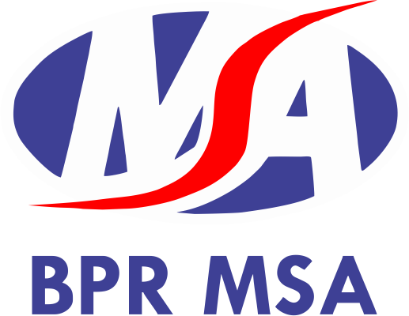

<div align="center">
  
  <h1>UMKM Catalog PT BPR MSA</h1>
  <p><strong>Sistem Digitalisasi Katalog UMKM untuk Mendukung Ekonomi Lokal</strong></p>
</div>

---

## 📋 Tentang Project

**UMKM Catalog PT BPR MSA** adalah platform digital yang dikembangkan oleh tim mahasiswa sebagai bagian dari program kerja praktik di PT BPR MSA. Sistem ini dirancang untuk mendigitalisasi dan mempermudah proses pengelolaan katalog produk UMKM (Usaha Mikro Kecil Menengah) yang menjadi mitra PT BPR MSA, sekaligus memperluas jangkauan pasar produk-produk lokal berkualitas.

### 🎯 Tujuan
- **Mendigitalisasi katalog produk UMKM** mitra PT BPR MSA secara terpusat dan terstruktur
- **Mempermudah akses konsumen** terhadap produk-produk UMKM berkualitas dari mitra PT BPR MSA
- **Meningkatkan efisiensi** dalam proses promosi dan penjualan produk UMKM
- **Mendukung pertumbuhan ekonomi lokal** melalui platform digital yang inovatif
- **Membangun ekosistem digital** yang kondusif untuk UMKM mitra PT BPR MSA

---

## ✨ Fitur Utama

### 🔍 **Manajemen Katalog Produk**
- **Upload & Management Produk**: UMKM dapat dengan mudah menambahkan, mengedit, dan mengelola produk mereka
- **Kategori Produk**: Sistem kategori yang terorganisir untuk memudahkan pencarian
- **Galeri Foto**: Upload multiple foto produk dengan preview otomatis
- **Status Produk**: Tracking status produk (draft, pending, approved, rejected)

### 👥 **Manajemen User & UMKM**
- **Registrasi UMKM**: Proses registrasi UMKM mitra dengan validasi dokumen
- **Dashboard Admin**: Panel admin untuk monitoring dan approval produk UMKM
- **Profil UMKM**: Halaman profil lengkap dengan informasi kontak dan media sosial
- **Role-based Access**: Hak akses yang terpisah untuk admin, UMKM, dan pengunjung

### 📱 **User Experience**
- **Responsive Design**: Tampilan optimal di desktop, tablet, dan mobile
- **Search & Filter**: Pencarian produk berdasarkan kategori, lokasi, atau keyword
- **Sorting Options**: Urutkan produk berdasarkan harga, terbaru, atau popularitas
- **Contact Form**: Formulir kontak langsung ke UMKM untuk inquiry pembelian

### 📊 **Analytics & Monitoring**
- **Dashboard Analytics**: Statistik produk, UMKM, dan engagement pengunjung
- **Notification System**: Notifikasi real-time untuk status produk dan aktivitas
- **Activity Log**: Tracking semua aktivitas dalam sistem untuk audit trail

---

## 🛠️ Teknologi yang Digunakan

### **Backend**
- **Laravel 10** - Framework PHP modern untuk backend yang robust
- **MySQL/MariaDB** - Database relasional untuk data produk dan UMKM
- **PHP 8.1+** - Bahasa pemrograman server-side dengan performa optimal

### **Frontend**
- **Blade Template Engine** - Templating engine bawaan Laravel
- **Bootstrap 5** - Framework CSS untuk responsive design
- **Tailwind CSS** - Utility-first CSS framework untuk styling modern
- **Alpine.js** - JavaScript framework untuk interaktivitas ringan

### **Tools & Dependencies**
- **Laravel Permission** - Package untuk role-based access control
- **Laravel Notifications** - Sistem notifikasi built-in Laravel
- **Intervention Image** - Manipulasi dan optimasi gambar produk
- **Laravel Debugbar** - Debugging tools untuk development

---

## 🚀 Cara Instalasi

### **Prasyarat**
- PHP 8.1 atau lebih baru
- Composer
- MySQL/MariaDB
- Node.js & NPM

### **Langkah Instalasi**

1. **Clone Repository**
   ```bash
   git clone https://github.com/finadio/meeting_room.git
   cd meeting_room
   ```

2. **Install Dependencies**
   ```bash
   composer install
   npm install
   ```

3. **Konfigurasi Environment**
   ```bash
   cp .env.example .env
   php artisan key:generate
   ```

4. **Setup Database**
   ```bash
   # Edit .env file dengan konfigurasi database Anda
   php artisan migrate --seed
   ```

5. **Build Assets**
   ```bash
   npm run build
   ```

6. **Jalankan Server**
   ```bash
   php artisan serve
   ```

Akses aplikasi di: `http://localhost:8000`

---

## 📋 Setup Awal

### **Akun Default**
- **Admin**: admin@msa.com / password
- **UMKM Sample**: umkm@example.com / password

### **Struktur Database**
- `users` - Data user admin dan UMKM
- `umkms` - Data detail UMKM mitra
- `products` - Katalog produk UMKM
- `categories` - Kategori produk
- `articles` - Artikel dan konten edukasi
- `contacts` - Formulir kontak dan inquiry

---

## 🎯 Panduan Penggunaan

### **Untuk Admin PT BPR MSA**
1. Login dengan akun admin
2. Review dan approve produk UMKM yang baru diupload
3. Monitor aktivitas dan statistik melalui dashboard
4. Kelola kategori produk dan konten artikel

### **Untuk UMKM Mitra**
1. Registrasi akun sebagai UMKM mitra
2. Lengkapi profil UMKM dengan informasi lengkap
3. Upload produk dengan foto dan deskripsi yang menarik
4. Monitor status produk dan respon dari pengunjung

### **Untuk Pengunjung**
1. Jelajahi katalog produk UMKM mitra PT BPR MSA
2. Gunakan fitur search dan filter untuk menemukan produk
3. Hubungi UMKM langsung melalui formulir kontak
4. Baca artikel edukasi tentang pengembangan UMKM

---

## 🤝 Kontribusi & Tim

**Project ini dikembangkan oleh:**
- Tim Mahasiswa Kerja Praktik PT BPR MSA
- Dibawah supervisi langsung tim IT PT BPR MSA
- Sebagai bagian dari program digitalisasi UMKM mitra

**Untuk pertanyaan atau kontribusi:**
- Email: [admin@msa.com](mailto:admin@msa.com)
- WhatsApp: [+62 XXX XXXX XXXX](https://wa.me/62XXXXXXXXXX)

---

## 📄 Lisensi

Aplikasi ini dikembangkan secara **open-source** dengan lisensi **MIT License**. Dapat digunakan dan dimodifikasi sesuai kebutuhan, dengan tetap mencantumkan kredit kepada PT BPR MSA.

---

## 🙏 Acknowledgments

- **PT BPR MSA** - Untuk kesempatan dan support dalam pengembangan project
- **Tim IT PT BPR MSA** - Untuk guidance dan best practices
- **UMKM Mitra** - Untuk partisipasi dan feedback dalam pengembangan sistem
- **Laravel Community** - Untuk framework dan ekosistem yang luar biasa

---

<div align="center">
  <p><strong>UMKM Catalog PT BPR MSA</strong></p>
  <p>Membangun Ekonomi Digital Lokal Bersama</p>
</div>
