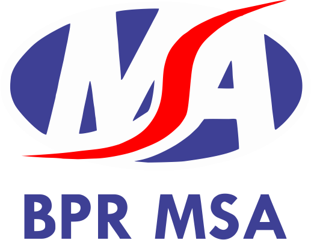
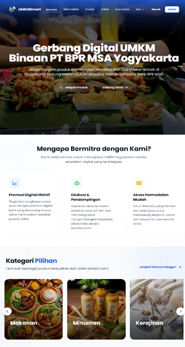
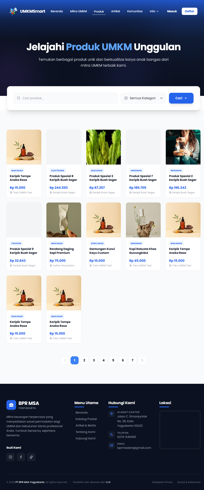
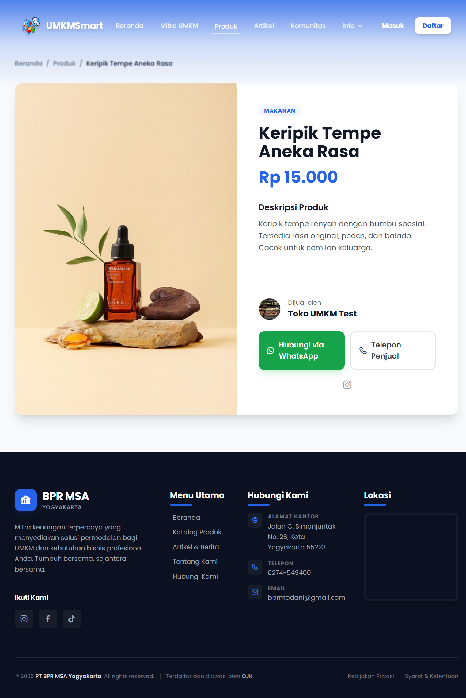
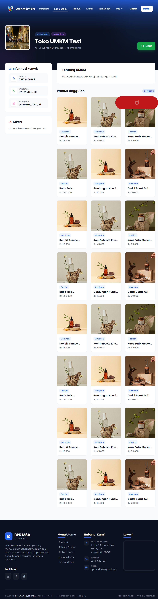
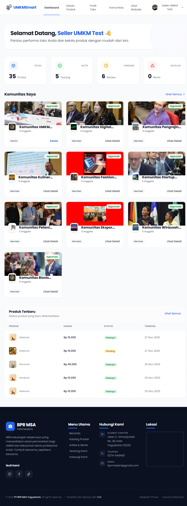
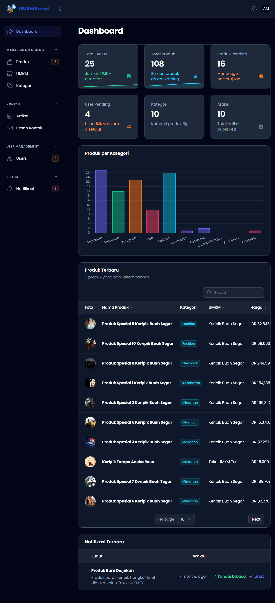
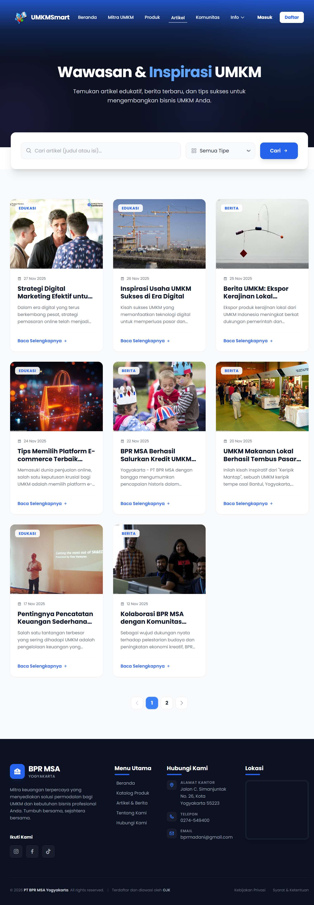
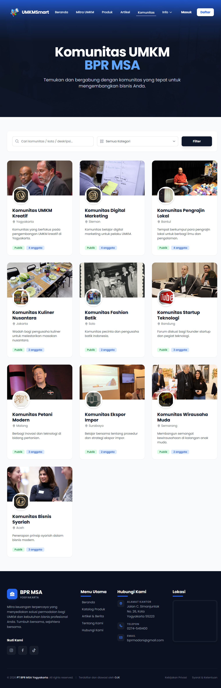

<div align="center">
  
  <h1>UMKMSmart</h1>
  <p><strong>Aplikasi katalog UMKM binaan PT BPR Madani Sejahtera Abadi Yogyakarta</strong></p>
</div>

---

## Tentang Project

UMKMSmart merupakan aplikasi web yang dikembangkan sebagai proyek Kerja Praktik di PT BPR Madani Sejahtera Abadi (BPR MSA) Yogyakarta. Sistem ini dibangun untuk membantu digitalisasi promosi produk UMKM binaan melalui katalog produk online, manajemen data UMKM, serta penyediaan ruang interaksi bagi komunitas pelaku usaha.

Aplikasi ini menerapkan Role-Based Access Control (RBAC) sehingga setiap pengguna memiliki hak akses sesuai perannya, mulai dari pengunjung, mitra UMKM, hingga administrator.

## Fitur

### Pengunjung
- Melihat katalog produk UMKM
- Mencari produk berdasarkan nama atau kategori
- Melihat profil UMKM
- Menghubungi pelaku UMKM melalui WhatsApp
- Membaca artikel dan informasi seputar UMKM
- Melihat daftar komunitas UMKM
- Mengirim pesan melalui halaman kontak

### Mitra UMKM
- Registrasi akun
- Mengelola profil usaha
- Menambah, mengubah, dan menghapus produk
- Melihat status persetujuan produk
- Mengajukan bergabung ke komunitas
- Membuat diskusi dan memberikan komentar
- Melihat dashboard ringkasan aktivitas

### Administrator
- Dashboard statistik
- Verifikasi akun UMKM
- Moderasi produk
- Manajemen kategori produk
- Manajemen artikel
- Manajemen komunitas
- Monitoring pesan dari pengguna

## Teknologi

| Komponen | Teknologi |
|---|---|
| Framework | Laravel 12 |
| Bahasa | PHP 8.2 |
| Admin Panel | Filament v3 |
| Frontend | Blade, Tailwind CSS, Alpine.js |
| Database | MySQL |
| Build Tool | Vite |
| Authentication | Laravel Sanctum |
| Authorization | Spatie Laravel Permission |

## Arsitektur

Project dikembangkan menggunakan pola Model-View-Controller (MVC) yang merupakan arsitektur bawaan Laravel.

Role pengguna dikelola menggunakan Role-Based Access Control (RBAC) dengan tiga level akses:

- Guest
- Mitra UMKM
- Administrator

## Modul

- Manajemen Produk
- Manajemen UMKM
- Katalog Publik
- Artikel
- Komunitas UMKM
- Verifikasi Produk
- Dashboard Admin
- Contact Us

## Tampilan Aplikasi

Berikut screenshot utama yang sudah tersedia di folder public/screenshoot:

| Halaman | Screenshot |
|---|---|
| Beranda |  |
| Katalog Produk |  |
| Detail Produk |  |
| Profil UMKM |  |
| Dashboard UMKM |  |
| Dashboard Admin |  |
| Artikel |  |
| Komunitas |  |

## Struktur Project

```text
app/
├── Http/
│   ├── Controllers/
│   └── Middleware/
├── Models/
database/
├── migrations/
└── seeders/
resources/
├── views/
└── css/
routes/
└── web.php
```

## Instalasi

Clone repository:

```bash
git clone <repository-url>
cd catalog_msauye
```

Install dependency:

```bash
composer install
npm install
```

Konfigurasi environment:

```bash
cp .env.example .env
php artisan key:generate
```

Sesuaikan konfigurasi database pada file `.env`, lalu jalankan migrasi:

```bash
php artisan migrate --seed
```

Buat symbolic link storage:

```bash
php artisan storage:link
```

Jalankan Vite:

```bash
npm run dev
```

Jalankan aplikasi:

```bash
php artisan serve
```

## Akun Demo

### Administrator

```text
Email    : admin@msa.com
Password : password
```

### Mitra UMKM

```text
Email    : umkm@example.com
Password : password
```

## Pengembang

**Fina Julianti**
Mahasiswa Informatika
Universitas Jenderal Soedirman

Project ini dikembangkan sebagai bagian dari Kerja Praktik di PT BPR Madani Sejahtera Abadi Yogyakarta.
